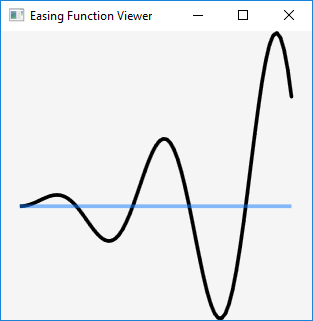

# Overview

This a WPF application (Windows and .NET Framework only) to visualize implementations of the `IEasingFunction` interface.

It also helps understanding what is going wrong when implementing your own custom one.

To change what to see, edit the `MainWindow.xaml.cs` file and set the local variable `easingFunction` to a different instance, with different parameters.

You can also change the sampling rate by modifying the `for` loop just after.

The curve bellow has been rendered with an `EllasticEase`, with `EasingMode` set to `EaseIn` and a `Springness` of `2.0`.
